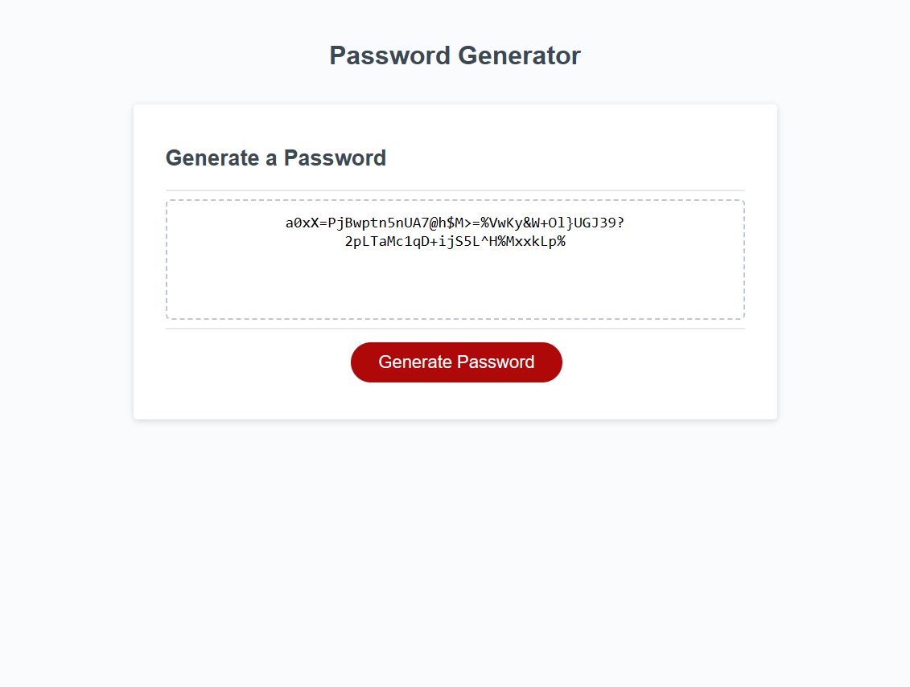

# JD_Random_Passwords

## Description

This readme contains information regarding the password generator website project I have worked on. The links to the deployed live site and repository can be found in the "Links" section of this readme. The HTML, CSS, and Javascript files can also be found in this repository. Starter code has been added to this repository and the Javascript for this project has been updated to satisfy acceptance criteria. This deployed application enables users to generate random passwords. The Javascript has been created and updated to add more dynamics to the HTML and CSS. 

## Installation

N/A

## Usage

When the user clicks the "Generate Password" button, then a series of prompts is displayed for password criteria:

  -The first prompt asks the user for the length of the password. The password must be at least 8 characters and no more than 128 characters.

  -The second prompt asks the user if they want to include lowercase letters in the password.

  -The third prompt asks the user if they want to include uppercase letters in the password.

  -The fourth prompt asks the user if they want to include numerical values in the password.

  -The fifth prompt asks the user if they want special characters in the password. 

  -After all prompts are answered, then a password is generated that matches the selected criteria and it is displayed on the webpage. 

## Links

Github repository URL: https://github.com/JarettDeSanti/JD_Random_Passwords  
Deployed live site URL: https://jarettdesanti.github.io/JD_Random_Passwords/

## Screenshot

## Credits

N/A

## License

Please refer to the LICENSE in the repository.

## Badges
N/A

## Features
N/A

## How to Contribute
N/A

## Tests
N/A
